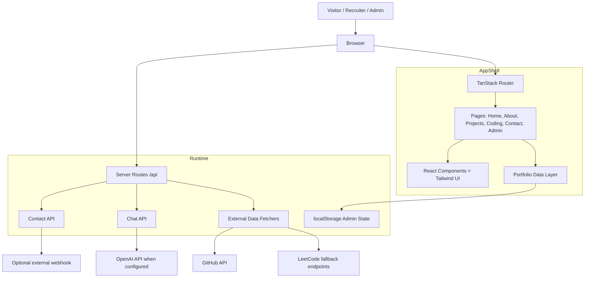

# Portfolio Architecture

## High-level system diagram

## Component responsibilities

- Frontend shell
  - TanStack Start handles routing, SSR, and the app shell.
  - React components render the portfolio pages and shared site layout.

- Content source
  - The portfolio data lives in `src/data/portfolio.ts`.
  - It provides profile data, project content, experience, certifications, and admin editing state.

- Feature pages
  - `src/routes/*` contains content pages such as home, projects, coding, contact, and admin.
  - These pages consume the portfolio data and render recruiter-facing content.

- API layer
  - `src/routes/api/contact.ts` handles contact form submissions.
  - `src/routes/api/chat.ts` handles chat requests with graceful fallback if the environment is not configured.

- Live data services
  - `src/lib/coding.functions.ts` fetches GitHub and LeetCode data, with fallback behavior for providers that block or limit direct requests.

- Admin flow
  - `src/routes/admin.tsx` provides a minimal content management interface.
  - Changes are saved to local storage in the current implementation.

## Current implementation status

### Completed

- Portfolio shell and navigation are in place.
- Branding and favicon polish were applied.
- Profile image flow and layout were corrected.
- GitHub and LeetCode data fetching were fixed with fallback handling.
- Contact form submission flow was implemented and validated.
- Admin editor exists for editing portfolio content.
- Assistant route degrades gracefully without a configured API key.

### Still optional / not required for the base portfolio

- A real OpenAI key for live AI responses.
- A production-grade database-backed CMS instead of localStorage persistence.
- A full email webhook or CRM integration for contact submissions.
- Deeper analytics and CMS features for lifecycle management.

## Recommendation

The project is already functional as a polished personal portfolio and working admin experience without requiring the OpenAI key. The remaining work is mainly production hardening and optional feature expansion rather than core app functionality.
